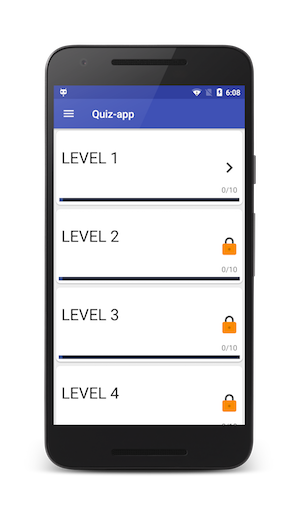
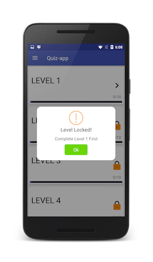
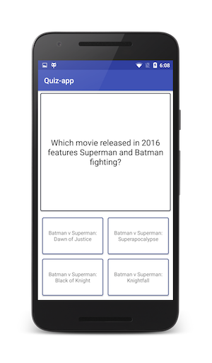
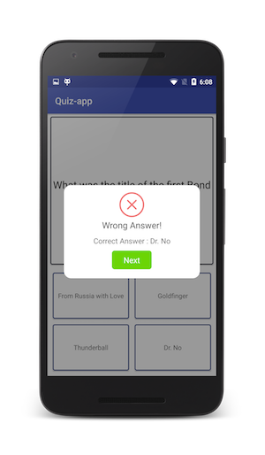

# Squad Quiz Application

## Features
1. The application is divided into 5 levels. To start a level, the user must complete the previous level.
2. Every incorrect question is asked 3 times for (Learning, Reviewing, Checking) purpose.
3. The user can not finish the level without answering all the questions. 
4. Every completed level can be reset and played again.
5. Mastered questions are also shown for better learning.

## Screenshots

  
Levels can not be skipped
         
     

